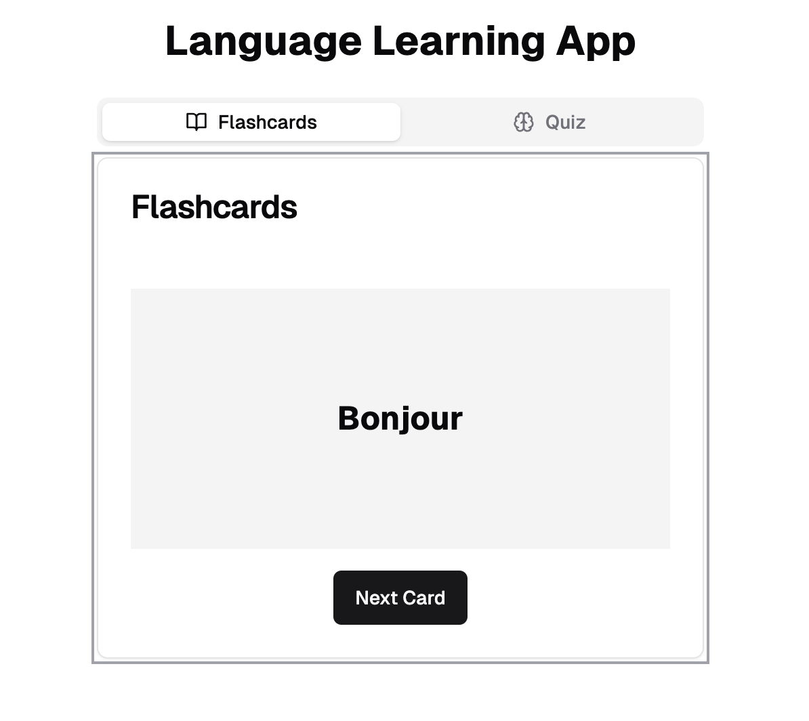
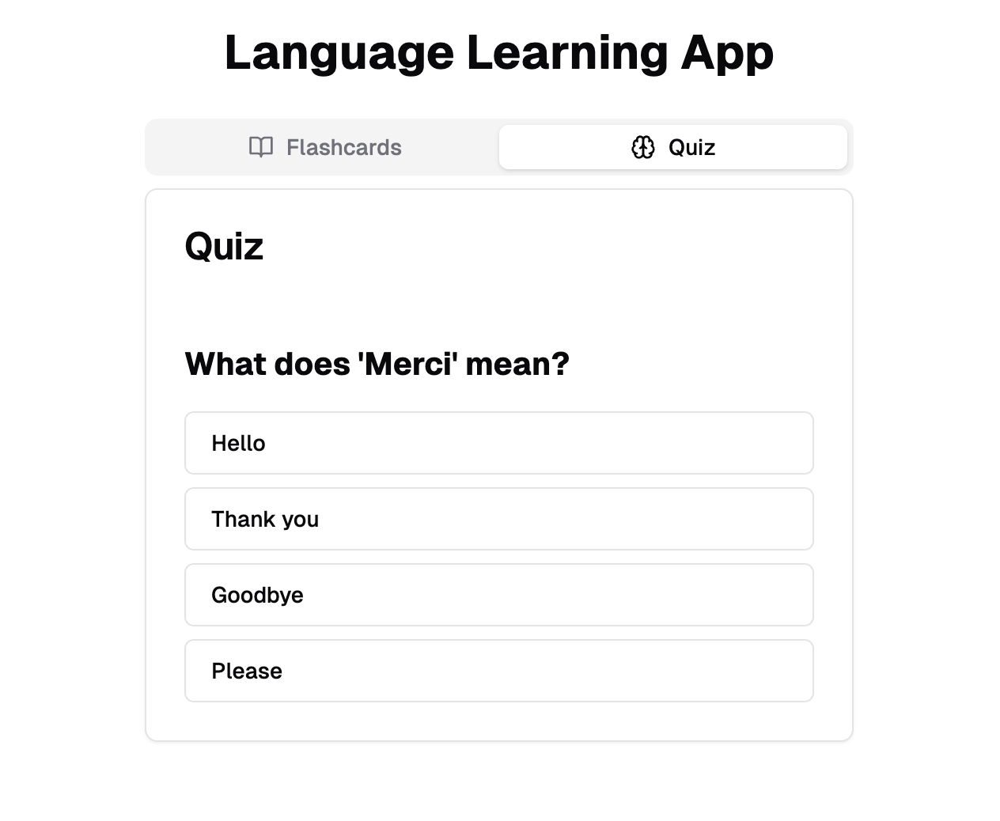

# Assignment 3: Language Learning App

## Author
Jonathan Vergonio

Utilizing V0 (Vercel)

## Overview
This project is a language learning application built with **React** and **TypeScript**. As someone with limited experience in web development, particularly with modern frameworks like React, TypeScript, and component libraries, this assignment provided a great opportunity to explore the process of creating a functional web application.

The goal was to create a language learning tool that could be further expanded for personal projects. The application currently includes two main features:
1. **Flashcards**: helps users practice vocabulary by flipping through flashcards.
2. **Quiz**: tests the user's knowledge of the vocabulary presented in the flashcards.

Here is the first screenshot showing the Flashcard:

Here is the second screenshot showing the Quiz:

## Features
- **Flashcards**: Users can flip through a set of flashcards with vocabulary in one language on the front and its translation on the back.
- **Quiz**: A quiz that asks users questions about the vocabulary they have learned. The user's score is tracked, and they can restart the quiz once completed.

## Components
The application is composed of several key components:

### `Flashcards`
- **State Management**: 
  - `currentCard`: Tracks the current flashcard being displayed.
  - `showBack`: Determines whether the front or back of the flashcard is shown.
- **Functionality**:
  - Flip the card to reveal the translation.
  - Move to the next card in the deck.

### `Quiz`
- **State Management**: 
  - `currentQuestion`: Tracks the current question in the quiz.
  - `score`: Tracks the user's score.
  - `showResult`: Indicates whether the quiz results should be displayed.
- **Functionality**:
  - Select an answer from multiple-choice options.
  - Track correct answers and display the final score.
  - Restart the quiz after completion.

## Technologies Used
- **React**: A JavaScript library for building user interfaces.
- **TypeScript**: A statically typed superset of JavaScript.
- **Tailwind CSS**: A utility-first CSS framework.
- **Lucide-React**: A collection of open-source icons as React components.
